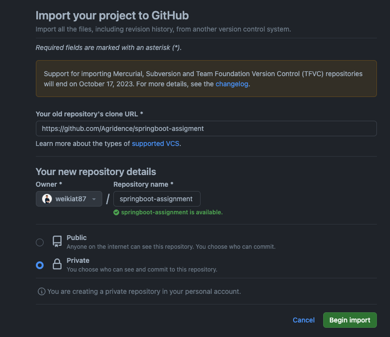
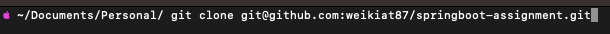

# Java Assignment
Welcome candidate to Agridence Java (Springboot) backend challenge! The goal of this assignment test your knowledge and best practices that you have on a day-to-day basis.

## How to start?
Import the project as a private repo https://github.com/new/import

Clone your private repo into your folder

start the project by running `mvn spring-boot:run`

### Note
- Feel free to make any assumption on the API request and response that you will need to create from the requirements.
- Make any adjustment to the folder structure if you have a better way of structuring it.
- Feel free to add any packages that you need to help create Entity, DAO, or DTO.

## Requirements
- As a user, When I signup for the application, I should be able to enter my username, password, and full name.
- As a user, When I login with the correct credential, I should receive an access token.
- As a user, When I login with the wrong credential, I should receive an error saying "invalid username/password"
- As a user, I should not be able to access my personal notes without validating my credential.
- As a user, I should not be able to access other people notes.
- As a user, I want to be able to add a note in my personal note.
- As a user, I want to be able to delete a note in my personal note.
- As a user, I want to be able to view a note details in my personal note.
- As a note, I should have a title that is shown in the user's personal notes
- As a note, I should have a description that is shown in the detail view.

## Submission
go to your private repo settings and add the reviewers as the collaborators.

## Reviewer Instructions
- Please add a REVIEW.md to give the reviewers for how we can review the application.
- Feel free to add ERD and APIs schema if needed.

## Java assignment reviewers
- [weikiat87](https://github.com/weikiat87)
- [sruthiganesh-HC](https://github.com/sruthiganesh-HC)
- [abhi-agridence](https://github.com/abhi-agridence)

## Getting Started

### Reference Documentation
For further reference, please consider the following sections:

* [Official Apache Maven documentation](https://maven.apache.org/guides/index.html)
* [Spring Boot Maven Plugin Reference Guide](https://docs.spring.io/spring-boot/docs/3.1.4/maven-plugin/reference/html/)
* [Create an OCI image](https://docs.spring.io/spring-boot/docs/3.1.4/maven-plugin/reference/html/#build-image)
* [Spring Boot DevTools](https://docs.spring.io/spring-boot/docs/3.1.4/reference/htmlsingle/index.html#using.devtools)
* [Spring Data JPA](https://docs.spring.io/spring-boot/docs/3.1.4/reference/htmlsingle/index.html#data.sql.jpa-and-spring-data)
* [Sentry](https://docs.sentry.io/platforms/java/)
* [Spring REST Docs](https://docs.spring.io/spring-restdocs/docs/current/reference/html5/)

### Guides
The following guides illustrate how to use some features concretely:

* [Accessing Data with JPA](https://spring.io/guides/gs/accessing-data-jpa/)
* [Getting Started with Sentry](https://docs.sentry.io/platforms/java/guides/spring-boot/)
